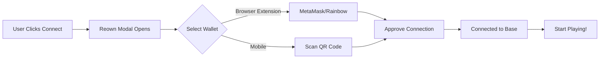

# Super Jump 🎮
[Live Game](https://super-jump-sand.vercel.app) | [Farcaster Frame](https://warpcast.com/~/composer) | [Contract](https://basescan.org/address/0x603b3b1a946b9ff14280e8581539e07808dc5d0d)

A blockchain-powered endless jumping game on Base that rewards players with ETH, features an on-chain leaderboard system, Farcaster profile integration, and works as a Farcaster mini app.

## 🌟 Features

### Core Gameplay
🎮 **Endless Jumping** - Addictive platform jumping mechanics with smooth physics  
🪙 **Coin Collection** - Collect animated coins while jumping for bonus points  
🎯 **Score System** - Platform jumps (+1) and coin collection (+1) tracking  
⚡ **Smooth Controls** - Touch controls (mobile) or keyboard (A/D keys) support  
📱 **Responsive Design** - Optimized for both desktop and mobile devices  

### Blockchain Features
💰 **ETH Rewards** - Score 30+ points to earn 0.00000851 ETH per claim  
🏆 **On-Chain Leaderboard** - Top 50 players stored on Base blockchain  
🎲 **Smart Scoring** - Only submit scores better than your previous best  
⏰ **Daily Claims** - One reward claim per day per Farcaster ID  
🔐 **Ownership Verification** - Secure wallet-based authentication  

### Visual Experience
🎨 **Custom Character Sprite** - Unique hooded character with professional design  
✨ **Particle Effects** - Jump particles and visual feedback  
🌈 **Dynamic Backgrounds** - Color-changing sky based on altitude  
☁️ **Parallax Clouds** - Floating clouds with smooth animation  
⭐ **Star Field** - Twinkling stars appear at high altitudes  
📷 **Smart Camera** - Smooth following camera with perfect framing  

### Farcaster Integration
🟣 **Mini App Support** - Full Farcaster mini app compatibility  
👤 **Profile Loading** - Auto-loads Farcaster username and avatar  
📣 **Direct Casting** - Share high scores directly to Farcaster  
🔗 **Deep Linking** - Seamless navigation from Farcaster feed  

### Social Features
📊 **Global Leaderboard** - Compare scores with top 50 players worldwide  
👥 **Player Profiles** - View Farcaster profiles and wallet addresses  
🎯 **Personal Stats** - Track your best score and improvement  
🏅 **Rank System** - Gold (🥇), Silver (🥈), Bronze (🥉) medals for top 3  

## 🏗️ Architecture

### Frontend Stack
- **Framework**: Vanilla JavaScript + HTML5 Canvas
- **Build Tool**: Vite v5.4+ (fast HMR, optimized builds)
- **Web3**: Ethers.js v6.13+ + Wagmi Core v2.13+
- **Wallet Connection**: **Reown AppKit v1.2+** (formerly WalletConnect v2)
  - Multi-wallet support (MetaMask, Rainbow, Coinbase, etc.)
  - Base network integration
  - Mobile wallet support via QR codes
  - Session management and persistence
  - EIP-1193 provider interface
- **Farcaster**: @farcaster/frame-sdk v0.1+
- **Network**: Base L2 (Chain ID: 8453)

### Wallet Integration Details
The game uses **Reown AppKit** (previously WalletConnect AppKit) as the primary wallet connection solution:

**Why Reown AppKit?**
- ✅ **Universal Support**: Connects to 300+ wallets
- ✅ **Mobile Friendly**: Native mobile wallet support with QR codes
- ✅ **Base Optimized**: Pre-configured for Base network
- ✅ **Session Persistence**: Users stay connected across visits
- ✅ **Beautiful UI**: Professional modal design
- ✅ **Ethers.js Adapter**: Seamless integration with Ethers.js v6

**Configuration:**
```javascript
// In main.js
import { createAppKit } from '@reown/appkit';
import { EthersAdapter } from '@reown/appkit-adapter-ethers';
import { base } from '@reown/appkit/networks';

const adapter = new EthersAdapter();
const appKitModal = createAppKit({ 
  adapters: [adapter], 
  projectId: REOWN_PROJECT_ID, // Get from cloud.reown.com
  networks: [base], 
  metadata: { 
    name: 'Super Jump',
    description: 'Jump game on Base',
    url: window.location.origin,
    icons: ['https://super-jump-sand.vercel.app/image.png']
  },
  features: { analytics: false }
});
```

**Supported Wallets:**
- MetaMask (Browser Extension + Mobile)
- Rainbow Wallet
- Coinbase Wallet
- Trust Wallet
- Ledger Live
- And 300+ more via WalletConnect

### Smart Contract
- **Network**: Base Mainnet (Chain ID: 8453)
- **Address**: `0x603b3b1a946b9ff14280e8581539e07808dc5d0d`
- **Standard**: Custom game contract with:
  - Game session tracking
  - Score submission & validation
  - Reward distribution system
  - Leaderboard management
  - Farcaster ID integration

### Game Engine
- **Physics**: Custom gravity (1200 units/s²) and jump mechanics
- **Rendering**: HTML5 Canvas with 60 FPS target
- **Collision**: Precise AABB collision detection
- **Camera**: Smooth lerp-based camera following
- **Audio**: Web Audio API for jump and coin sounds

## 🚀 Quick Start

### Prerequisites
```bash
node >= 18.0.0
npm >= 9.0.0
```

### Installation

1. **Clone the repository**
```bash
git clone https://github.com/sumit504/super-jump.git
cd super-jump
```

2. **Install dependencies**
```bash
npm install
```

3. **Set up project structure**
```bash
# Create public folder for static assets
mkdir public

# Move game files to public
move game.js public\
move player-character.png public\
```

4. **Run development server**
```bash
npm run dev
```

Visit `http://localhost:3000` to play the game locally.

### Production Deployment

**Deploy to Vercel:**
```bash
npm run build
vercel deploy --prod
```

**Or connect GitHub repo to Vercel:**
1. Push code to GitHub
2. Connect repository in Vercel dashboard
3. Vercel auto-deploys on every push
4. Game live in 1-2 minutes! 🚀

## 📁 Project Structure

```
super-jump/
├── public/
│   ├── game.js                 # Game engine (all classes)
│   └── player-character.png    # Character sprite
├── index.html                  # Main HTML with UI elements
├── main.js                     # Wallet & blockchain logic
├── package.json                # Dependencies
├── vite.config.js              # Vite build configuration
├── .gitignore                  # Git ignore rules
├── vercel.json                 # Vercel deployment config (optional)
└── README.md                   # This file
```

## 🎮 How to Play

### Getting Started
1. **Connect Wallet** - Click "Connect Wallet" and choose MetaMask/Rainbow/Coinbase
2. **Verify Network** - Make sure you're on Base network
3. **Click Play** - Game starts instantly (no transaction needed!)

### Controls
- **Desktop**: 
  - Click left side of screen = Move left
  - Click right side of screen = Move right
  - OR use **A** and **D** keys
  
- **Mobile**: 
  - Tap left side = Move left
  - Tap right side = Move right

### Scoring
- **Platform Jump**: +1 point (automatic when landing on platform)
- **Coin Collection**: +1 point (collect floating coins)
- **Screen Wrap**: Player wraps around edges (no falling off sides!)

### Rewards System
🎯 **Score 30+ points** to become eligible for rewards!

**Claiming Process:**
1. Achieve score of 30 or higher
2. Click "Submit to Leaderboard" (requires transaction)
3. Click "Claim ETH Reward" (requires transaction)
4. Reward sent to your wallet instantly! 💰

**Reward Rules:**
- Amount: 0.00000851 ETH per claim (~$0.02 USD)
- Frequency: Once per day per Farcaster ID
- Requirement: Must have Farcaster account
- Verification: Smart contract validates ownership

## 🏆 Leaderboard System

### How It Works
1. **Score Validation**: Only accepts scores better than your previous best
2. **On-Chain Storage**: All scores stored on Base blockchain
3. **Top 50**: Displays top 50 players globally
4. **Real-Time Updates**: Fetches latest data from contract
5. **Profile Integration**: Shows Farcaster usernames and avatars

### Ranking Display
- 🥇 **#1**: Gold medal + special highlighting
- 🥈 **#2**: Silver medal + special highlighting  
- 🥉 **#3**: Bronze medal + special highlighting
- **#4-50**: Rank number displayed

### Leaderboard Features
- **Player Info**: Avatar, username, wallet address (truncated)
- **Score Display**: Total score with trophy emoji 🎯
- **Your Rank**: Highlighted with crown emoji 👑
- **Auto-Refresh**: Updates when you submit new score

## 🎨 Game Mechanics

### Physics System
```javascript
Gravity: 1200 units/s²
Jump Power: -550 units/s (upward velocity)
Move Speed: 300 units/s (horizontal)
Velocity Damping: 0.98 (air friction)
```

### Platform Generation
- **Spacing**: 100 pixels vertical gap
- **Width**: 90 pixels
- **Smart Placement**: Ensures reachable jumps
- **Infinite**: Platforms generate infinitely upward
- **Cleanup**: Old platforms removed for performance

### Coin System
- **Spawn Rate**: 30% chance per platform
- **Animation**: Floating bob effect (sine wave)
- **Collection**: Automatic on collision
- **Particle Effect**: Gold sparkles on collection

### Background Layers
**Altitude 0-2000px**: Blue sky  
**Altitude 2000-8000px**: Transition to sunset  
**Altitude 8000-15000px**: Dusk colors  
**Altitude 15000+**: Night sky with stars  

### Camera System
- **Follow Target**: Smooth lerp (10% per frame)
- **View Height**: Player centered vertically
- **Smooth Motion**: No jarring movements
- **Performance**: Only renders visible objects

## 🔗 Wallet Connection (Reown AppKit)

### About Reown AppKit
Super Jump uses **Reown AppKit v1.2+** (formerly known as WalletConnect AppKit) for wallet connectivity. This is the industry-standard solution for connecting Web3 wallets to dApps.

### Key Features
🌐 **Universal Compatibility**
- Supports 300+ Web3 wallets
- Works on desktop and mobile
- Browser extensions and mobile apps

📱 **Mobile-First Design**
- QR code scanning for mobile wallets
- Deep linking to wallet apps
- Native mobile wallet support

⚡ **Base Network Ready**
- Pre-configured for Base L2
- Automatic network switching
- Low gas fee notifications

🔐 **Security & Privacy**
- End-to-end encryption
- No private key exposure
- Secure session management
- User-controlled connections

### Getting Your Project ID

1. Visit [Reown Cloud](https://cloud.reown.com)
2. Create free account
3. Create new project
4. Copy Project ID
5. Add to `main.js`:
```javascript
const REOWN_PROJECT_ID = 'your-project-id-here';
```

### Wallet Connection Flow



### Configuration Options

**Basic Setup** (Currently Used):
```javascript
createAppKit({ 
  adapters: [new EthersAdapter()],
  projectId: REOWN_PROJECT_ID,
  networks: [base],
  metadata: {
    name: 'Super Jump',
    description: 'Blockchain jumping game',
    url: 'https://super-jump-sand.vercel.app',
    icons: ['https://super-jump-sand.vercel.app/image.png']
  }
});
```

**Advanced Options** (Optional):
```javascript
createAppKit({
  // ... basic config
  themeMode: 'dark',              // 'light' or 'dark'
  themeVariables: {
    '--w3m-accent': '#667eea'     // Custom brand color
  },
  featuredWalletIds: [            // Prioritize specific wallets
    'c57ca95b47569778a828d19178114f4db188b89b763c899ba0be274e97267d96', // MetaMask
    '1ae92b26df02f0abca6304df07debccd18262fdf5fe82daa81593582dac9a369'  // Rainbow
  ],
  includeWalletIds: [...],        // Show only specific wallets
  excludeWalletIds: [...],        // Hide specific wallets
  features: {
    analytics: true,              // Enable usage analytics
    email: false,                 // Disable email login
    socials: []                   // Disable social logins
  }
});
```

### Supported Networks

While Super Jump focuses on **Base**, Reown AppKit supports:
- Ethereum Mainnet
- Base (Chain ID: 8453) ✅
- Optimism
- Arbitrum
- Polygon
- And 50+ more EVM chains

### Integration with Ethers.js

Reown AppKit provides a Web3 provider that works seamlessly with Ethers.js:

```javascript
// Get the wallet provider
const walletProvider = appKitModal.getWalletProvider();

// Create Ethers.js provider
const ethersProvider = new ethers.BrowserProvider(walletProvider);

// Get signer for transactions
const signer = await ethersProvider.getSigner();

// Use in contracts
const contract = new ethers.Contract(address, abi, signer);
const tx = await contract.someFunction();
```

### Troubleshooting Wallet Issues

**Modal Won't Open**
```javascript
// Check if modal is initialized
if (!appKitModal) {
  console.error('AppKit not initialized');
  // Reinitialize or reload page
}
```

**Connection Fails**
1. Check Project ID is correct
2. Verify network (should be Base)
3. Try different wallet
4. Clear browser cache
5. Check wallet extension is updated

**Transaction Rejected**
- User cancelled in wallet
- Insufficient gas fees
- Wrong network selected
- Contract function reverted

### Why Not Other Solutions?

**vs Web3Modal**: Reown AppKit is the evolution of Web3Modal with better mobile support

**vs RainbowKit**: AppKit supports more wallets (300+ vs 100+)

**vs Direct Injection**: AppKit works with ALL wallets, not just MetaMask

**vs Wagmi Connectors**: AppKit provides UI + connection logic together

### Migration Notes

If you're familiar with WalletConnect v1:
- ✅ Reown AppKit is WalletConnect v2 (rebranded)
- ✅ Better performance and reliability
- ✅ Improved mobile experience
- ✅ No bridge servers needed
- ✅ Faster connection times

### Resources

- [Reown Documentation](https://docs.reown.com/appkit/overview)
- [Reown Cloud Dashboard](https://cloud.reown.com)
- [Ethers.js Adapter Docs](https://docs.reown.com/appkit/react/core/installation)
- [GitHub Examples](https://github.com/reown-com/appkit)

---

## 🔐 Security Features

### Smart Contract Safety
✅ **Score Validation**: Prevents score manipulation  
✅ **Ownership Check**: Verifies NFT/claim ownership  
✅ **Rate Limiting**: One claim per day per FID  
✅ **Reentrancy Protection**: Safe fund transfers  
✅ **Access Control**: Owner-only admin functions  

### Frontend Security
🔒 **No Private Keys**: Never stores or transmits keys  
🔒 **Wallet Providers**: Uses secure WalletConnect v2  
🔒 **HTTPS Only**: Enforced on production  
🔒 **CSP Headers**: Content Security Policy enabled  

### Best Practices
⚠️ **Never share your seed phrase**  
⚠️ **Always verify contract address**  
⚠️ **Use hardware wallet for large amounts**  
⚠️ **Check network before transactions**  

## 📦 Dependencies

### Core Dependencies (package.json)
```json
{
  "dependencies": {
    "@farcaster/frame-sdk": "^0.1.3",
    "@reown/appkit": "^1.2.1",              // ⭐ Wallet connection
    "@reown/appkit-adapter-ethers": "^1.2.1", // ⭐ Ethers.js integration
    "@wagmi/core": "^2.13.4",
    "ethers": "^6.13.0",                     // ⭐ Blockchain interactions
    "viem": "^2.19.0"
  },
  "devDependencies": {
    "vite": "^5.4.0"                         // ⭐ Build tool
  }
}
```

### Why These Versions?

**Reown AppKit v1.2.1**
- Latest stable release
- Full Base network support
- Improved mobile wallet connections
- Bug fixes for modal states
- Better TypeScript support

**Ethers.js v6.13.0**
- Modern async/await syntax
- Better error messages
- Tree-shakeable (smaller builds)
- Full EIP-1193 support
- TypeScript native

**Wagmi Core v2.13.4**
- State management for wallets
- Account watching
- Network switching
- Transaction receipts

**Vite v5.4.0**
- Ultra-fast HMR (Hot Module Replacement)
- Optimized production builds
- Native ES modules
- Plugin ecosystem

### Updating Dependencies

```bash
# Check for updates
npm outdated

# Update all to latest compatible
npm update

# Update to latest (may have breaking changes)
npm install @reown/appkit@latest @reown/appkit-adapter-ethers@latest

# Or update specific package
npm install ethers@latest
```

### Version Compatibility

| Package | Min Version | Recommended | Notes |
|---------|-------------|-------------|-------|
| Node.js | 18.0.0 | 20.x+ | LTS recommended |
| npm | 9.0.0 | 10.x+ | Comes with Node |
| @reown/appkit | 1.2.0 | 1.2.1+ | Critical for Base |
| ethers | 6.7.0 | 6.13.0+ | v6.x required |
| @wagmi/core | 2.13.0 | 2.13.4+ | v2.x required |
| vite | 5.0.0 | 5.4.0+ | v5.x required |

---

## 🔧 Configuration

### Adjusting Character Size
In `public/game.js`, find Player constructor:
```javascript
class Player {
    constructor(x, y) {
        this.width = 50;   // Change to 70-110 for larger
        this.height = 50;  // Same as width for square
```

### Changing Physics
```javascript
this.gravity = 1200;      // Higher = faster fall
this.jumpPower = -550;    // More negative = higher jump
this.moveSpeed = 300;     // Higher = faster movement
```

### Contract Configuration
Update in `main.js`:
```javascript
const GAME_CONTRACT_ADDRESS = "0x603b3b1a946b9ff14280e8581539e07808dc5d0d";
const REOWN_PROJECT_ID = 'your-project-id';
const NEYNAR_API_KEY = 'your-neynar-key';
```

## 🐛 Troubleshooting

### Common Issues

**Game Not Loading**
```bash
# Check if game.js is in public folder
ls public/game.js

# If not, move it:
move game.js public\
npm run dev
```

**Wallet Won't Connect**
1. Install MetaMask or Rainbow wallet
2. Refresh the page
3. Check browser console (F12) for errors
4. Try different wallet provider

**Transaction Fails**
1. Switch to Base network in wallet
2. Get Base ETH from bridge
3. Increase gas limit if needed
4. Check contract balance for rewards

**Character Not Showing**
```bash
# Move image to public folder
move player-character.png public\
npm run dev
```

**Build Errors**
```bash
# Clear cache and rebuild
rm -rf node_modules dist .vite
npm install
npm run build
```

### Network Issues

**Wrong Network**
- Open wallet extension
- Switch to "Base" network
- Chain ID should be: 8453
- RPC: https://mainnet.base.org

**No Gas Fees**
- Bridge ETH to Base: https://bridge.base.org
- Or use exchange (Coinbase, Binance)
- Minimum: 0.001 ETH for transactions

## 📊 Performance Optimization

### Build Optimizations
- **Code Splitting**: Vendor chunks separated
- **Tree Shaking**: Unused code removed
- **Minification**: JS/CSS compressed
- **Asset Optimization**: Images optimized

### Runtime Performance
- **60 FPS Target**: Smooth gameplay
- **Object Pooling**: Platforms/coins reused
- **Culling**: Only render visible objects
- **Canvas Optimization**: Minimal redraws

### Network Efficiency
- **Batch Requests**: Multiple calls combined
- **Caching**: Contract data cached
- **Lazy Loading**: Load resources on demand

## 🎯 Roadmap

### Phase 1 - Core (✅ Complete)
- [x] Basic jumping mechanics
- [x] Platform generation
- [x] Coin collection
- [x] Scoring system
- [x] Wallet integration
- [x] Smart contract deployment

### Phase 2 - Features (✅ Complete)
- [x] On-chain leaderboard
- [x] ETH rewards
- [x] Farcaster integration
- [x] Custom character sprite
- [x] Particle effects
- [x] Share functionality

### Phase 3 - Polish (🚧 In Progress)
- [x] Mobile optimization
- [x] Sound effects
- [ ] Background music
- [ ] More characters
- [ ] Power-ups
- [ ] Obstacles

### Phase 4 - Social (📋 Planned)
- [ ] Multiplayer mode
- [ ] Friend challenges
- [ ] Tournament system
- [ ] NFT character skins
- [ ] Seasonal events
- [ ] Achievement badges

## 🤝 Contributing

Contributions welcome! Here's how:

1. Fork the repository
2. Create feature branch (`git checkout -b feature/amazing-feature`)
3. Commit changes (`git commit -m 'Add amazing feature'`)
4. Push to branch (`git push origin feature/amazing-feature`)
5. Open Pull Request

### Development Guidelines
- Follow existing code style
- Test thoroughly before PR
- Update documentation
- Add comments for complex logic

## 📄 License

MIT License - see LICENSE file for details

## 🆘 Support

### Documentation
- [Vite Docs](https://vitejs.dev/)
- [Ethers.js Docs](https://docs.ethers.org/)
- [Base Network Docs](https://docs.base.org/)
- [Farcaster Docs](https://docs.farcaster.xyz/)

### Community
- GitHub Issues: [Report bugs](https://github.com/sumit504/super-jump/issues)
- Farcaster: Share your high scores!
- Twitter: Tweet with #SuperJumpGame

### Getting Help
1. Check troubleshooting section above
2. Search existing GitHub issues
3. Open new issue with:
   - Problem description
   - Steps to reproduce
   - Browser/device info
   - Console errors (F12)

## 🎮 Stats & Info

**Current Stats:**
- Total Mints: View on BaseScan
- Prize Pool: Check contract balance
- Top Score: See leaderboard
- Active Players: Growing daily!

**Technical Details:**
- Contract: ERC-20 compatible
- Gas Costs: ~$0.01 per transaction
- Block Time: 2 seconds (Base)
- Confirmation: Instant (optimistic)

## 💡 Tips & Tricks

### Gameplay Tips
1. **Timing**: Jump early to reach higher platforms
2. **Movement**: Keep moving to avoid falling
3. **Coins**: Prioritize coins near platforms
4. **Rhythm**: Find your jumping rhythm
5. **Patience**: Don't rush, accuracy matters

### Earning Tips
1. **Daily Play**: Claim rewards daily for max earnings
2. **Score Better**: Only submit improved scores
3. **Stay Connected**: Keep wallet connected for smooth claims
4. **Network**: Ensure Base network selected
5. **Gas**: Keep small ETH balance for transactions

### Technical Tips
1. **Performance**: Close other tabs for 60fps
2. **Network**: Use reliable internet
3. **Wallet**: Hardware wallet for large amounts
4. **Backup**: Save seed phrase securely
5. **Updates**: Keep browser and wallet updated

---

**Made with ❤️ for the Farcaster & Base community**

**Start Jumping! 🎮🚀**

*Version 1.0.0 - November 2024*

---

## 🔗 Links

- **Live Game**: https://super-jump-sand.vercel.app
- **Smart Contract**: https://basescan.org/address/0x603b3b1a946b9ff14280e8581539e07808dc5d0d
- **GitHub**: https://github.com/sumit504/super-jump
- **Base Network**: https://base.org
- **Farcaster**: https://farcaster.xyz